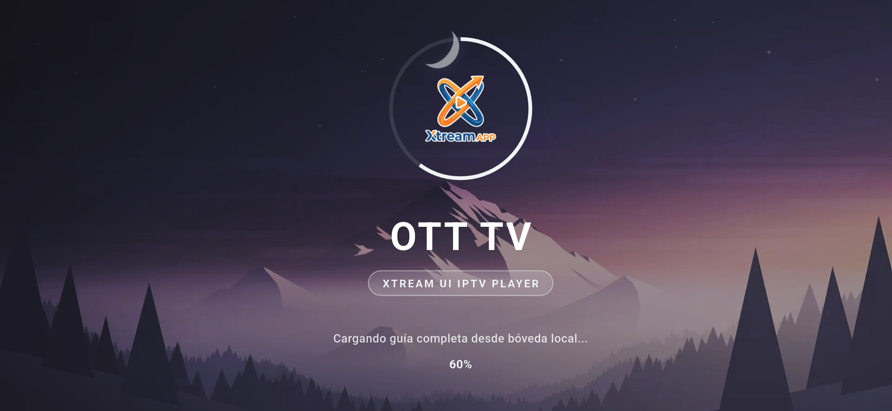

# 📺 OTT TV — Professional Xtream UI IPTV Application

**OTT TV** es una plataforma profesional de reproducción IPTV de alta velocidad, diseñada para ofrecer una experiencia cinematográfica en dispositivos **Android TV, Fire TV Stick, TV Box, teléfonos móviles Android y computadoras con Windows**.

  

---

## ✨ Características Principales

### ⚡ Reproducción de Cero Latencia (< 1 Segundo) & Soporte Multiprotocolo
- **Motor Nativo (60 FPS en Xiaomi Mi Box / Dongles)**: Decodificación por hardware de alto rendimiento para transmisiones sin congelamientos ni caídas de fotogramas.
- **Soporte Protocolos Avanzados & Formatos de Transmisión**:
  - ✅ **HLS (`.m3u8`)** y **MPEG-TS (`.ts`)**
  - ✅ **UDP Multicast / Unicast (`udp://@...`)**
  - ✅ **Conversor UDPxy (`http://.../udp/...`)**
  - ✅ **RTP (`rtp://@...`)** y **SRT (Secure Reliable Transport)**
  - ✅ **RTMP / RTSP / HTTP / HTTPS**
  - ✅ **Formatos VOD (MP4 / MKV / AVI)**
- **Apertura de Canal Instantánea**: Transmisiones en vivo listas en menos de **1 segundo**.

### 🎨 Diseño Premium Glassmorphism 
- **Interfaz 16:9 Nativa Adaptativa**: Diseñada para lucir en televisores de pantalla grande y celulares.
- **Navegación Híbrida 100% Optimizada**: Control remoto (**D-Pad de TV Box / FireStick**) y **pantalla táctil en móviles**.
- **Guía Rápida por Categoría**: Muestra únicamente los canales de la categoría actual con autocentrado del canal activo.
- **Visualizador de Expiración Real**: Muestra el nombre de usuario y la fecha exacta de vencimiento de la membresía Xtream UI (`Expira: DD/MM/YYYY`) en la pantalla principal.

### 📐 Control Avanzado de Aspect Ratio & Ajustes
- **Selector de Formato en Pantalla**: Cambia al instante entre `16:9`, `4:3`, `Ajustar`, `Estirar` y `Zoom`.
- **Selector Multi-Audio**: Resincronización instantánea de idiomas y pistas secundarias de voz sin interrupciones.

### 🔐 Autenticación Xtream UI Codes API
- Inicio de sesión mediante **Servidor / DNS, Usuario y Contraseña**.
- Conexión directa y segura con servidores Xtream UI sin intermediarios.

### 🛡️ Seguridad & Protección Familiar
- **Bóveda Cifrada (AES-256)**: Almacenamiento seguro de credenciales e historial.
- **Protección Anti-Sniffer**: Bloqueo activo de captura de tráfico de red para proteger los servidores del proveedor.
- **Control Parental Integrado**: Bloqueo de canales y categorías para adultos mediante PIN de seguridad.

### 📼 Experiencia de Usuario Avanzada
- **Guía Electrónica de Programación (EPG)**: Consulta de programación en tiempo real y soporte para carga de EPGs recientes.
- **Historial de Reproducción Inteligente**: El reproductor recuerda exactamente en qué minuto y segundo dejaste una película o serie para que puedas reanudarla al instante.

### 📢 Panel de Notificaciones Integrado
- Envía mensajes y notificaciones en tiempo real a todos los usuarios de la aplicación mediante nuestro panel web de administración:
  - 🔗 **[Panel de Notificaciones de OTT TV](https://noti.galaxybeatsrecords.com/)**

---

## 📲 Descargar Ejecutables / Releases

Puedes descargar los binarios compilados listos para instalar desde la sección de **Releases**:

- 🤖 **Android (TV / TV Box / Móvil)**: `OTT_TV_Android_v1.0.0.apk`
- 💻 **Windows (PC / Laptop)**: `OTT_TV_Windows_v1.0.0.zip`

👉 **[Ir a la sección de Releases / Descargas](https://github.com/dev-error404/XUI-Palyer/releases)**

---

## 📞 Ventas, Licencias y Personalización Marca Blanca (White-Label)

Para adquirir licencias comerciales, personalizar la aplicación con tu propia marca / logo / DNS, o solicitar soporte técnico:

📲 **Contacto Directo WhatsApp**: [+51 974 180 638](https://wa.me/51974180638?text=Hola,%20deseo%20informaci%C3%B3n%20sobre%20la%20compra%20de%20OTT%20TV)  
👤 **Desarrollador**: Pablo A.  
🌐 **GitHub**: [dev-error404](https://github.com/dev-error404)
